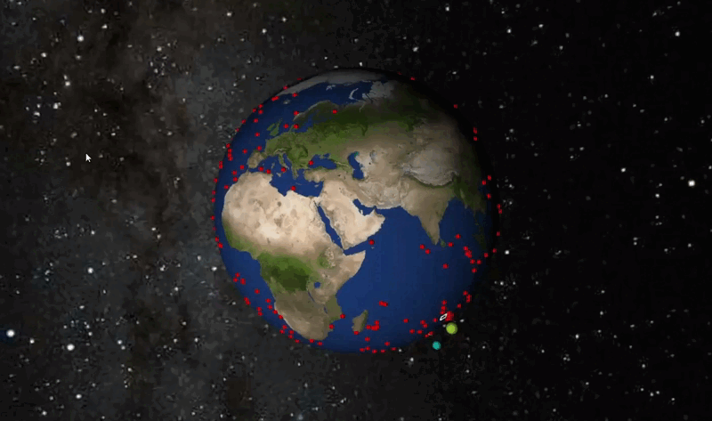

# AI-Based-Tip-and-Cue



**Under development.**\
Expected release: Early 2026

Find out more at: [ESA Φ-lab Collaborative Innovation Network - AI-Based Tip and Cue](https://cin.philab.esa.int/databases/projects/laying-the-foundation-for-ai-based-tip-and-cue)

## Dependencies

- [Mitsuba-3](https://mitsuba.readthedocs.io/en/stable/index.html): physics-based rendering engine to model radiance and geometric effects at off-nadir viewing angles.
- [pySMARTS](https://github.com/NREL/pySMARTS/tree/main/pySMARTS)   (Simple Model of the Atmospheric Radiative Transfer of Sunshine): to simulate incident solar spectral irradiance based on solar geometry, atmosphere, and surface characteristics.
- [PASEOS](https://github.com/aidotse/PASEOS): to simulate spacecraft subsystem states, including field of view windows, attitude pointing, and stabilization (through custom modules).
- [Orekit](https://www.orekit.org): to propagate satellite trajectories and state vectors.

### Dataset
[Whales from Space Dataset](https://data.bas.ac.uk/full-record.php?id=GB/NERC/BAS/PDC/01592) : 633 patches of Very High Resolution (VHR) whale imagery from WorldView-2, -3, QuickBird-2, and GeoEye-1 satellites.

## Installation

### Requirements
- Anaconda / Miniconda: https://www.anaconda.com/download/success
- PyCharm (or another Python IDE): https://www.jetbrains.com/pycharm/download/?section=windows

### Create Environment
Clone the AI-Based Tip and Cue repository in your local folder and navigate to the folder.
```bash
git clone https://github.com/ESA-PhiLab/AI-Based-Tip-and-Cue.git
cd AI-Based-Tip-and-Cue
```

From Anaconda prompt, create your Conda environment.
```bash
conda env create -f environment.yml
conda activate tipandcue
```

Launch PyCharm.
```bash
pycharm64
```

Add your new environment:

Add new interpreter -> Add local interpreter -> Select existing -> Conda -> Path to Conda: C:\Users\\\*username*\miniconda3\Scripts\conda.exe ,  Environment: C:\Users\\\*username*\miniconda3\envs\tipandcue

### Install Paseos
Clone the PASEOS repository, merging with the AI-Based Tip and Cue PASEOS custom packages.
```bash
git clone https://github.com/aidotse/PASEOS.git PASEOS_tmp
cp -r PASEOS_tmp/* PASEOS/
cp -r PASEOS_tmp/.* PASEOS/ 2>/dev/null
rm -rf PASEOS_tmp
```

Install additional dependencies.
```bash
cd PASEOS
pip install -e . --no-deps
```

### Install Orekit

1. From https://jdk.java.net/25/ (or a newer version), download the Windows/x64 .zip file. 
2. Extract the zip file to: C:\Program Files\Java\jdk-25.
3. Edit Windows Environment variables: (search -> Environment variables -> Edit the system environment variables)

System variables:
Name: JAVA_HOME  
Value: C:\Program Files\Java\jdk-25*

User variables:
Edit Path -> New -> %JAVA_HOME%\bin

Click Ok to complete and verify the the installation via Command prompt.
```bash
java --version
```

From Anaconda prompt, install Orekit.
```bash
conda install -c conda-forge orekit
```

Download Orekit data
```bash
pip install git+https://gitlab.orekit.org/orekit/orekit-data.git
```

### Complete Mitsuba installation

Install LLVM 18.1 (no newer version, otherwise it crashes with DrJit) from: https://github.com/llvm/llvm-project/releases?page=4.
Expand Assets, then download + execute LLVM-18.1.6-win64.exe file.

Add Environment variable:
System variables:
Name: DRJIT_LIBLLVM_PATH
Value: C:\Program Files\LLVM\bin\LLVM-C.dll

### Install pySMARTS

Download SMARTS software from: https://www.nrel.gov/grid/solar-resource/smarts

Extract the .zip and place it in: C:\Program Files\SMARTS_295_PC

Add Environment variable:
System variables:
Name: SMARTSPATH
Value: C:\Program Files\SMARTS_295_PC

### Installation Troubleshooting
On some PCs, 'import mitsuba' crashes with a silent error after run, error code (0xC0000005). If this happens, try the following.
- !! First check your LLVM version. It should be lower than LLVM 18.1, otherwise it is imcompatible with DrJit. To install, obtain the LLVM-18.1.6-win64.exe file from https://github.com/llvm/llvm-project/releases?page=4 and execute.
- Re-install Microsoft VS Code redistributables (both x64 and x86): https://learn.microsoft.com/en-us/cpp/windows/latest-supported-vc-redist
- (Re-)install Visual Studio Code: https://visualstudio.microsoft.com/downloads/
- (Re-)install Visual Studio 2022: https://www.junian.net/dev/visual-studio-community-download-links/ownloads/ . Enable 'Desktop Development with C++' and thick all optional feature boxes.
- (Re-)install CUDA Toolkit: https://developer.nvidia.com/cuda-downloads?target_os=Windows&target_arch=x86_64


## Usage

```bash
to be completed.
```

## Contact
Nadine Duursma, N.A.Duursma at outlook.com 

## Reference
```bash
@software{AI-Based-Tip-and-Cue,
  title        = {AI-Based-Tip-and-Cue Simulation Framework},
  author       = {Duursma, Nadine Anje},
  organization = {{European Space Agency (ESA) Phi-Lab}},
  version      = {0.1.1},
  year         = {2025},
  url          = {https://github.com/ESA-PhiLab/AI-Based-Tip-and-Cue}
}
```


